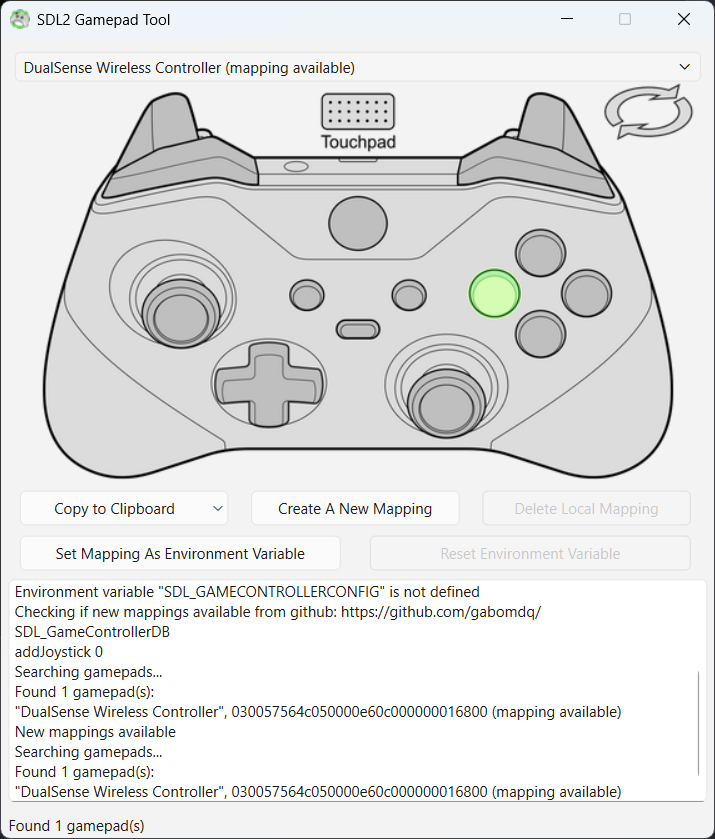

# SDL2 Gamepad Tool

Simple GUI tool to create and modify gamepad mappings for games that use the SDL2 Game Controller API.

Created as an alternative to the Steam Big Picture gamepad configurator.



## Features

- Test gamepad buttons, axes, triggers, and hats in real time
- Create SDL2 controller mappings through a step-by-step binding wizard
- Save mappings locally and export to clipboard
- Update the community gamecontrollerdb.txt database from GitHub
- Set SDL_GAMECONTROLLERCONFIG environment variable for immediate use
- Cross-platform: Linux, macOS, Windows (64-bit)

## Architecture

The codebase follows a modular structure:

```
src/
  main.cpp                  Entry point
  ui/                       UI layer (MainWindow, .ui form)
  core/                     Core logic
    SDLPollEvent            SDL event loop on a QThread
    GamepadMapper           Mapping state machine (binding wizard)
    GamepadDatabase         Controller DB file management
    JoystickEnumerator      Joystick discovery helper
    Logger                  Centralized logging (console + UI signal)
  network/                  Network utilities
    FileDownloader          HTTP GET wrapper
  platform/                 Platform abstractions
    Environment             Abstract env var interface (Linux/Mac/Win)
  resources/                Icons, images, .qrc files, gamecontrollerdb.txt
tests/                      QtTest unit tests (6 suites)
scripts/                    Build and packaging scripts
```

Thread model: MainWindow runs on the main Qt event loop. SDLPollEvent runs SDL_PollEvent on a QThread, communicating via Qt signals and `std::atomic<bool>` flags.

## Dependencies

- Qt 5.15+ or Qt 6 (Core, Gui, Widgets, Network)
- SDL2 (auto-downloaded via CMake FetchContent if not found)
- CMake 3.16+
- C++17 compiler

## Build

### Linux (Ubuntu/Debian)

```bash
sudo apt install build-essential cmake qtbase5-dev libqt5network5-dev libsdl2-dev
mkdir build && cd build
cmake ..
make -j$(nproc)
```

### macOS

```bash
brew install qt@6 sdl2
scripts/build_macos.sh
```

This produces a universal binary (Intel + Apple Silicon) app bundle at `build/src/gamepad-tool.app` with Qt frameworks bundled.

To create a distributable DMG:
```bash
scripts/package_macos.sh
```

### Linux Packaging

AppImage (portable, single file):
```bash
scripts/package_linux_appimage.sh
```

Debian package (depends on system Qt5/SDL2):
```bash
scripts/package_linux_deb.sh
```

Tarball with bundled libraries:
```bash
scripts/package_linux_tarball.sh
```

### Windows (Git Bash/MSYS2)

Requires Qt 6 with the MinGW kit installed via the Qt Online Installer.

```bash
scripts/build_windows.sh
```

The script auto-detects Qt and MinGW under `C:/Qt`. Set `QT_BASE`, `QT_VERSION`, `MINGW_KIT`, or `MINGW_DIR` to override.

Binary: `build/src/gamepad-tool.exe`

To create a distributable ZIP:
```bash
scripts/package_windows.sh
```

This runs `windeployqt` automatically and packages the exe with all required Qt DLLs and plugins into `SDL2-Gamepad-Tool-<version>-windows-x64.zip`.

## Test

```bash
cd build
ctest --output-on-failure
```

Tests cover: SDLPollEvent state transitions, GamepadMapper binding logic, GamepadDatabase file operations, Logger, JoystickEnumerator, and Environment interface.

## Install (Linux)

```bash
cd build
sudo make install
```

This installs the binary to `/usr/local/bin/` and the desktop file and icon to the appropriate XDG directories.

## Contributing

1. Fork the repository and create a feature branch
2. Follow existing code style: PascalCase files/classes, camelCase methods, m_ member prefix
3. Add QtTest tests for new core logic
4. Run `ctest --output-on-failure` before submitting
5. Keep commits focused and descriptive

## Developed by

[General Arcade](https://generalarcade.com)

## License

MIT License. See [LICENSE](LICENSE) for details.
